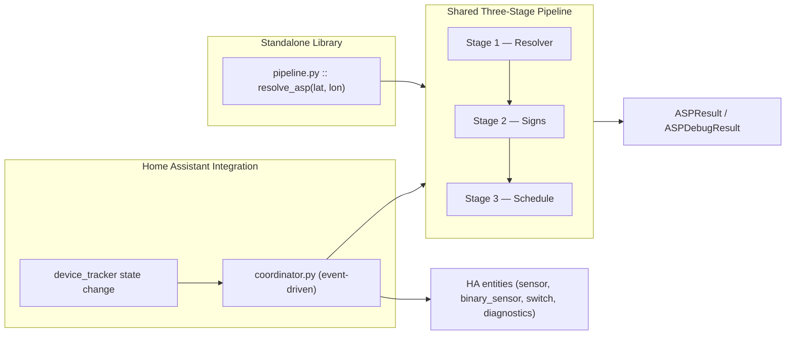
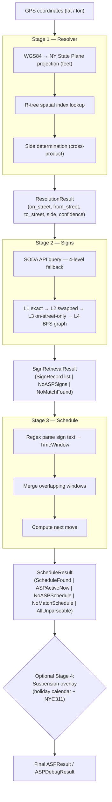
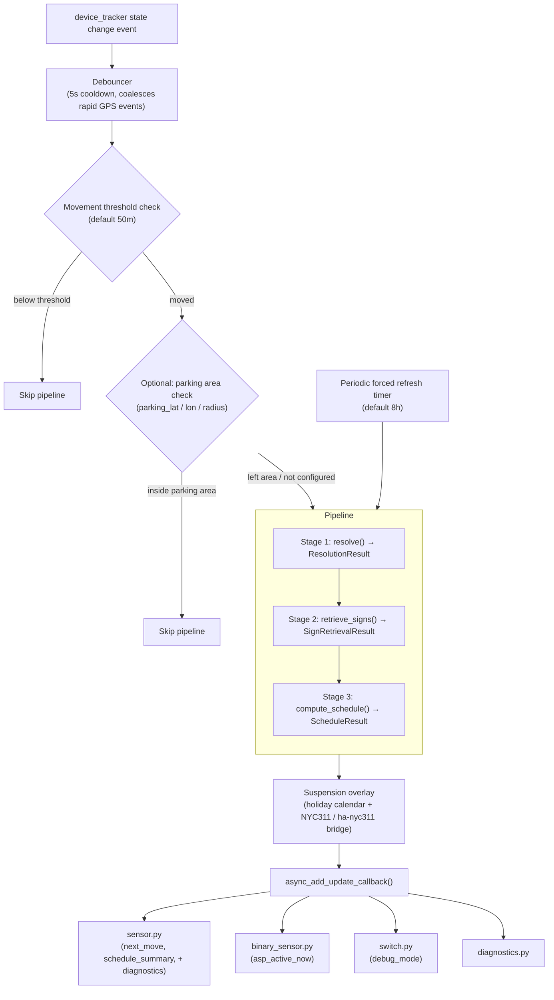
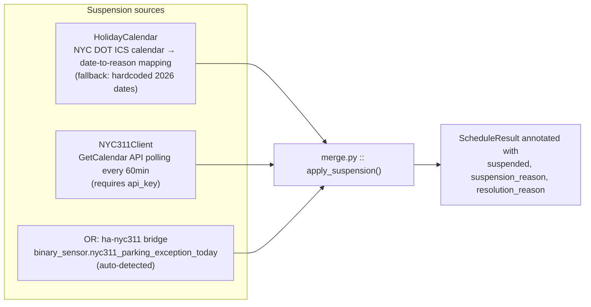

<!-- generated-by: gsd-doc-writer -->
# GPS2ASP-Resolver Architecture

A developer reference covering the three-stage pipeline, suspension calendar subsystem,
Home Assistant integration, spatial index, configuration, and developer setup.

---

## Table of Contents

1. [Overview](#1-overview)
2. [Architecture Diagram](#2-architecture-diagram)
3. [Three-Stage Pipeline](#3-three-stage-pipeline)
   - [Stage 1 — Resolver](#stage-1--resolver-resolver)
   - [Stage 2 — Signs](#stage-2--signs-signs)
   - [Stage 3 — Schedule](#stage-3--schedule-schedule)
   - [Entry Point](#entry-point--pipelinepy)
4. [Suspension Calendar Subsystem](#4-suspension-calendar-subsystem-suspension)
5. [Home Assistant Integration](#5-home-assistant-integration-custom_componentsasp_parking)
6. [Spatial Index](#6-spatial-index)
   - [Index Lifecycle: Automated Rebuild Pipeline](#index-lifecycle-automated-rebuild-pipeline)
7. [Configuration Reference](#7-configuration-reference)
   - [Environment Variables](#71-environment-variables)
   - [Home Assistant Config Flow](#72-home-assistant-config-flow)
   - [Debug Overrides](#73-debug-overrides-debug-mode-only)
8. [Developer Setup](#8-developer-setup)
9. [Data Model Conventions](#9-data-model-conventions)

---

## 1. Overview

`gps2asp` converts GPS coordinates (latitude, longitude) to NYC Alternate Side Parking (ASP)
schedules. It is both a standalone Python library and a Home Assistant custom integration.
The library is pure Python with no Home Assistant dependencies. The HA integration vendors
the library for HACS distribution, making the integration fully self-contained.

Top-level pipeline:

```
GPS (lat, lon) → NY State Plane → CSCL spatial index → street segment + side
    → SODA API signs → parsed schedule → next move datetime
```

---

## 2. Architecture Diagram

Both deployment modes share the same three-stage pipeline. In standalone use, `pipeline.py`
exposes a single `resolve_asp()` async function. In the HA integration, the coordinator
drives the same stages inline and distributes results to entity callbacks.

### Top-level architecture



### Three-stage pipeline data flow



---

## 3. Three-Stage Pipeline

### Stage 1 — Resolver (`resolver/`)

The resolver converts WGS84 GPS coordinates to a specific NYC street segment and side
(N/S/E/W). It projects the coordinates into the NY State Plane coordinate system
(in feet) to enable accurate distance calculations against the CSCL street network, then
queries a spatial R-tree index to find candidate segments within a search radius. The
best candidate is selected by scoring based on distance, street width, and ASP presence.
The cross-product of the query vector against the segment geometry determines which side
of the street the coordinate falls on.

Modules:

- `converter.py` — Projects WGS84 lat/lon to NY State Plane (feet) using `pyproj`.
- `spatial_index.py` — Lazy-loaded singleton R-tree index over ~160K CSCL street
  segments; returns candidate segments within a configurable search radius.
- `side_resolver.py` — Uses cross-product geometry to determine which side (N/S/E/W)
  of the nearest segment the coordinate falls on.
- `confidence.py` — Scores the resolution quality based on perpendicular distance,
  street width, and whether the segment has ASP regulations.
- `models.py` — `ResolutionResult`, `SegmentCandidate`, `ResolutionDebugInfo` frozen
  dataclasses.
- `exceptions.py` — `OutsideNYCError`, `NoSegmentFoundError`, `AmbiguousResolutionError`,
  `IndexNotFoundError`.
- `logging.py` — JSON debug logging helpers for resolution attempts.

Output: a `ResolutionResult` containing `on_street`, `from_street`, `to_street`,
`side_of_street` (N/S/E/W), `confidence` (0.0–1.0), `has_asp` flag, `borocode`,
`perpendicular_distance_ft`, `street_width_ft`, and `segment_id`.

### Stage 2 — Signs (`signs/`)

The signs stage fetches NYC Open Data parking sign records for the resolved block face.
It translates the CSCL street names from Stage 1 into the format used by the SODA API,
then queries the NYC Open Data parking signs endpoint. To handle data quality issues in
the SODA dataset, a multi-level fallback query strategy is used: an exact four-field
match is tried first, then the cross-street fields are swapped, then an on-street-only
query with client-side filtering, and finally a BFS traversal of the street adjacency
graph to find mid-span blocks that fall inside a SODA sign record without matching its
boundary streets.

Modules:

- `client.py` — `SODAClient`: async `httpx` client against the NYC Open Data SODA API
  (resource `nfid-uabd.json`). Implements Levels 1–3 fallback query strategy with
  pagination (batch size 1000) and exponential backoff (3 retries).
- `graph.py` — `StreetGraph`: street adjacency graph from `data/index/graph.json`;
  supports Level 4 mid-span BFS matching for blocks that fall in the middle of a SODA
  sign record rather than at its boundary cross-streets.
- `normalize.py` — Translates street names between CSCL format and SODA format at the
  API boundary.
- `exceptions.py` — `SODAAPIError`, `IncompleteResultsError`.
- `models.py` — `SignRecord`, `SignRetrievalSuccess`, `NoASPSigns`, `NoMatchFound`
  frozen dataclasses; `SignRetrievalResult` discriminated union.

All SODA queries filter to active ASP signs only via
`sign_description LIKE '%SANITATION BROOM%'` and `sign_design_voided_on_date IS NULL`.

Output: a `SignRetrievalResult` — either a `SignRetrievalSuccess` containing a list of
`SignRecord` objects and the SODA fallback level (1–4) that matched, `NoASPSigns`
when the block exists in SODA but has no ASP regulations, or `NoMatchFound` when all
fallback levels are exhausted.

### Stage 3 — Schedule (`schedule/`)

The schedule stage parses raw sign description text into a structured weekly schedule and
computes the next upcoming cleaning window. Each sign description is parsed with regex
into day-of-week and time range components (`TimeWindow` objects). When multiple signs
cover the same block, overlapping windows are merged. The next occurrence of any window
relative to the current NYC-local time is then computed, and a human-readable summary
string is assembled.

Modules:

- `parser.py` — Regex parser: sign description text → `TimeWindow` objects (day-of-week,
  start time, end time).
- `merge.py` — Deduplicates and merges overlapping `TimeWindow` objects from multiple
  signs on the same block face.
- `next_move.py` — Computes the next upcoming cleaning window relative to now, in NYC
  local time (`America/New_York`).
- `summary.py` — Produces a human-readable schedule string
  (e.g., `"Mon 8–9:30 AM, Thu 11:30 AM–1 PM"`).
- `models.py` — `TimeWindow`, `CleaningWindow`, `WeeklySchedule`, `ParseFailure`, and
  the `ScheduleResult` discriminated union: `ScheduleFound`, `ASPActiveNow`,
  `NoASPSchedule`, `NoMatchSchedule`, `AllUnparseable`.

Output: a `ScheduleResult`. When signs parse successfully, `ScheduleFound` or
`ASPActiveNow` carries the `next_window` (`CleaningWindow`), the full `WeeklySchedule`,
location fields, and a human-readable `summary`. Typed failure variants indicate why a
result could not be produced (`no_asp`, `no_match`, `all_unparseable`). Both
`ScheduleFound` and `ASPActiveNow` carry optional suspension annotation fields
(`suspended`, `suspension_reason`, `resolution_reason`) added by Stage 4.

### Entry Point — `pipeline.py`

`resolve_asp(lat, lon, debug=False, suspension_status=None)` wires all three stages and
an optional Stage 4 suspension annotation into a single async call.

- When `debug=False` (default), returns `ASPResult` — a lean result object for production
  use containing the `ScheduleResult`, resolution failure flag, and SODA fallback level.
- When `debug=True`, returns `ASPDebugResult` — the full intermediate state from all
  stages (State Plane coordinates, `ResolutionResult`, raw `SignRetrievalResult`,
  `ScheduleResult`, SODA level, `borocode`, `perpendicular_distance_ft`,
  `street_width_ft`, `segment_id`) for diagnostics and testing.
- `AmbiguousResolutionError` from Stage 1 is caught and surfaced as structured fields on
  the result rather than propagating. All other errors propagate to the caller.
- When `suspension_status` is provided (a `SuspensionInfo`), Stage 4 runs
  `apply_suspension()` after Stage 3 to annotate the schedule result with `suspended`,
  `suspension_reason`, and `resolution_reason` fields.

---

## 4. Suspension Calendar Subsystem (`suspension/`)

The suspension subsystem is a cross-cutting layer that overlays holiday and emergency
suspension data on top of Stage 3 schedule output. It is applied by the coordinator as
an optional final step; the three core pipeline stages themselves have no knowledge of
suspension state.

Modules:

- `__init__.py` (`HolidayCalendar`, `SuspensionInfo`) — Fetches the NYC DOT annual ICS
  calendar from `nyc.gov`. Parses `VEVENT` entries to build a date-to-reason mapping.
  Falls back to a hardcoded calendar (2026 confirmed dates) when the ICS fetch fails.
  Exposes `is_suspended(date)` returning a `SuspensionInfo`. Also exports
  `apply_suspension()` which annotates a `ScheduleResult` with suspension fields.
- `poller.py` (`NYC311Client`, `NYC311AuthError`) — Polls the NYC 311 GetCalendar API
  for real-time emergency ASP suspension announcements (weather events, sanitation
  emergencies). Also handles integration with the `ha-nyc311` HA integration as an
  alternative data source. Raises `NYC311AuthError` on HTTP 401/403.
- `merge.py` (`apply_suspension`) — Merges holiday and NYC311 suspension signals into a
  single `SuspensionInfo` and applies it to a `ScheduleResult`, setting the `suspended`,
  `suspension_reason`, and `resolution_reason` fields on `ScheduleFound` /
  `ASPActiveNow` variants.

`SuspensionInfo` carries:

| Field | Type | Description |
|---|---|---|
| `is_suspended` | `bool` | Whether ASP is suspended for the queried date |
| `reason` | `str \| None` | Human-readable reason (e.g., `"MLK Day"`) |
| `source` | `Literal['holiday', 'emergency', 'ha_nyc311', 'none']` | Where the suspension signal came from |

---

## 5. Home Assistant Integration (`custom_components/asp_parking/`)

### Coordinator event flow



**Key design:** The coordinator is event-driven, not polled. It does not subclass
`DataUpdateCoordinator`. Entities register callbacks directly via
`async_add_update_callback()`. The pipeline runs only when the device tracker moves
beyond the configured movement threshold, plus a periodic forced refresh.

**Entities provided:**

| Entity | Platform | Description |
|---|---|---|
| `sensor.asp_next_move` | `sensor` | Datetime of the next upcoming ASP cleaning window |
| `binary_sensor.asp_active_now` | `binary_sensor` | `true` when currently inside a cleaning window |
| `switch.asp_debug_mode` | `switch` | Toggles coordinator debug mode in-memory (resets to off on restart) |
| `sensor.asp_confidence_score` | `sensor` (diagnostic) | Resolution confidence score 0.0–1.0 |
| `sensor.asp_soda_level` | `sensor` (diagnostic) | SODA fallback level that resolved this location (1–4) |
| `sensor.asp_resolved_street` | `sensor` (diagnostic) | Resolved on-street name in CSCL format |
| `sensor.asp_resolution_status` | `sensor` (diagnostic) | Resolution outcome string |
| `sensor.asp_last_resolved` | `sensor` (diagnostic) | Timestamp of last successful pipeline run |
| `sensor.asp_last_error` | `sensor` (diagnostic) | Last pipeline error message |
| `sensor.asp_latitude` | `sensor` (diagnostic) | Last resolved latitude |
| `sensor.asp_longitude` | `sensor` (diagnostic) | Last resolved longitude |
| `sensor.asp_car_name` | `sensor` (diagnostic) | Device tracker friendly name |
| `sensor.asp_vin` | `sensor` (diagnostic) | VIN from vehicle integration (if available) |
| `sensor.asp_index_last_rebuilt` | `sensor` (diagnostic) | Timestamp of the last successful spatial-index rebuild |
| `binary_sensor.asp_index_rebuilding` | `binary_sensor` (diagnostic) | `true` while a spatial-index rebuild is in progress |
| `binary_sensor.asp_gps_pipeline_healthy` | `binary_sensor` (diagnostic) | `true` when GPS is recent and the last pipeline run did not error |
| `button.asp_rebuild_index` | `button` (config) | Triggers an on-demand spatial-index rebuild |

**Diagnostics support:** `diagnostics.py` implements `async_get_config_entry_diagnostics()`
for the HA Diagnostics viewer. Sensitive fields (`parking_lat`, `parking_lon`,
`debug_lat`, `debug_lon`, `nyc311_api_key`, `notify_service`) are automatically redacted.

**Suspension integration:** At startup the coordinator loads `HolidayCalendar` and
checks today's date. If an `nyc311_api_key` is configured, `NYC311Client` polls the
NYC311 API every 60 minutes. The coordinator also auto-detects the
`binary_sensor.nyc311_parking_exception_today` entity from the companion `ha-nyc311`
integration; when present, it subscribes to its state changes for real-time suspension
updates and bypasses direct 311 API polling.



**HACS distribution:** `custom_components/asp_parking/gps2asp/` is a vendored copy of
the `src/gps2asp/` library. The integration does not rely on the library being installed
separately — everything is self-contained for HACS users.

**First-run index download:** On first HA setup, if no local spatial index exists, the
integration downloads `index.zip` from the GitHub releases page and extracts it
automatically. No manual build step is required for HA users.

**Push notifications:** When `notify_service` is configured, the coordinator sends a
push notification via `hass.services.async_call("notify", ...)` when a cleaning window
starts within the configured lead time (default 120 minutes). Each unique
`CleaningWindow` triggers at most one notification.

---

## 6. Spatial Index

The spatial index is a prerequisite for Stage 1 and must be built or downloaded before
the resolver can run.

**Files produced by `scripts/build_index.py`:**

| File | Description |
|---|---|
| `data/index/segments.idx` + `segments.dat` | R-tree binary index files (rtree library format) |
| `data/index/segments.json` | Segment attributes: geometry WKT, street names, ASP presence flags, `streetwidth`, `borocode` |
| `data/index/graph.json.zst` | Street adjacency graph for mid-span BFS, zstandard-compressed (used by `signs/graph.py`) |
| `data/index/build_info.json` | Build timestamp, CSCL/ASP/calibration row counts, propagation stats, file sizes, and build duration (no per-borough breakdown) |

Index files are gitignored. Each developer must build locally or download from the
release. Override the index path with the `GPS2ASP_INDEX_DIR` environment variable or
by passing `index_dir=` to `SpatialIndex`.

**Borough codes:**

| Code | Borough |
|---|---|
| 1 | Manhattan |
| 2 | Bronx |
| 3 | Brooklyn |
| 4 | Queens |
| 5 | Staten Island |

**Known coverage (Phase 9 index build — baseline, not live):**

| Borough | Coverage |
|---|---|
| Brooklyn | 47.9% |
| Manhattan | 29.5% |
| Bronx | 28.6% |
| Queens | 18.1% |
| Staten Island | ~0% (no SODA data) |

These figures date to the Phase 9 build. The index now rebuilds automatically every month
(see [Index Lifecycle](#index-lifecycle-automated-rebuild-pipeline) below), but
`build_info.json` does not recompute or store a per-borough breakdown, so there is no way
to verify current coverage from the repository — treat this table as a rough historical
baseline rather than a live figure.

Mid-span blocks — blocks that fall inside a SODA sign record rather than at its boundary
cross-streets — return `no_match` at Levels 1–3. The Level 4 BFS traversal via
`StreetGraph` (Phase 11) addresses this gap.

### Index Lifecycle: Automated Rebuild Pipeline

The spatial index is rebuilt and republished automatically on a rolling GitHub release,
decoupled from code releases:

- **`.github/workflows/index-rebuild.yml`** — runs on a self-hosted runner on a monthly
  cron schedule (`0 6 1 * *` UTC) or via manual `workflow_dispatch`. It rebuilds the index
  with `scripts/build_index.py`, packages it with `scripts/package_index_release.py`, and
  publishes the result to the rolling `index-v1` GitHub release. This workflow is a
  deliberate sibling of `release.yml` (which owns the `v*` code-release cadence): NYC curb
  geometry changes independently of code, so the two cadences are kept decoupled by design.
  There is no `push:` trigger — the citywide build is too heavy to run per-commit.
- **`scripts/package_index_release.py`** — a fail-closed packager. It reads the freshly
  built `build_info.json` and refuses to publish (non-zero exit) if `calibrated_count`
  doesn't clear its gate, preventing a degraded index from ever reaching the rolling
  release.
- **`scripts/update_checker.py`** — compares the local index's `build_timestamp` (from
  `build_info.json`) against the published release to detect whether a newer index is
  available.
- **Manual on-demand rebuild** — pressing the `button.asp_rebuild_index` entity calls
  `coordinator.async_request_rebuild()`, which performs the same fire-and-forget
  download/extract/atomic-swap sequence as the automated first-run download. The
  coordinator's `_is_rebuilding` flag and `_rebuild_lock` prevent concurrent rebuilds from
  overlapping; `binary_sensor.asp_index_rebuilding` mirrors `_is_rebuilding` live, and
  `sensor.asp_index_last_rebuilt` records the timestamp once the rebuild completes.

---

## 7. Configuration Reference

### 7.1 Environment Variables

| Variable | Required | Default | Description |
|---|---|---|---|
| `GPS2ASP_INDEX_DIR` | No | `src/gps2asp/data/index/` | Override path to the spatial index directory. Useful for testing with a custom index or in CI environments. |
| `NYC_OPEN_DATA_APP_TOKEN` | No | (none) | NYC Open Data SODA API app token. Without it, requests share the anonymous rate-limit pool. Obtain from `data.cityofnewyork.us`. |
| `NYC_311_API_KEY` | No | (none) | NYC 311 API subscription key for emergency suspension polling. Used by `NYC311Client` as a fallback when no key is configured in the HA options flow. |

### 7.2 Home Assistant Config Flow

Configured via the HA UI. No YAML required.

**Initial setup (three-step wizard):**

The config flow walks through three steps. Only the device tracker is stored as config
entry `data` (fixed after setup); everything else is stored as `options` (reconfigurable
any time without removing the integration).

| Step | Field | Description |
|---|---|---|
| Step 1: Device tracker | `device_tracker` | The `entity_id` of the `device_tracker` to follow (e.g., `device_tracker.my_phone`) |
| Step 2: Thresholds | `movement_threshold` | Minimum GPS displacement (meters, default 50) before the pipeline re-runs |
| Step 2: Thresholds | `refresh_interval` | Periodic forced refresh interval (hours, default 8), even without GPS movement |
| Step 2: Thresholds | `stale_timeout` | Duration (hours, default 8) after which sensors are marked unavailable if no update received |
| Step 3: API keys | `nyc311_api_key` | Optional NYC311 API key for weather/emergency suspension alerts |

**Options (reconfigurable any time via Options flow):**

In addition to the threshold and API key fields above, the options flow exposes:

| Field | Description |
|---|---|
| `nyc311_entity` | Optional HA `binary_sensor` entity ID to read NYC311 suspension state from (alternative to direct API polling) |
| `notify_service` | Optional HA notify service name for move reminders (e.g., `mobile_app_my_phone`) |
| `notify_lead_time` | Minutes before a cleaning window to send push notification (default 120) |
| `parking_lat` / `parking_lon` | Optional fixed parking area coordinates. Pipeline is skipped if the car has not left this area (within `parking_radius` meters). |
| `parking_radius` | Radius in meters for the parking area check (default 500) |
| `debug_lat` / `debug_lon` | Override coordinates used when debug mode is active |
| `debug_datetime` | Override datetime used when debug mode is active (ISO 8601 string) |
| `suppress_notifications` | When debug mode is active, suppress push notifications |

### 7.3 Debug Overrides (debug mode only)

Debug mode is toggled at runtime via the `switch.asp_debug_mode` entity on the HA
dashboard. The state is in-memory only — it resets to `off` on every HA restart by
design. When debug mode is active, the coordinator ignores the real device tracker and
instead resolves against the configured `debug_lat` / `debug_lon` / `debug_datetime`.
The debug datetime also replaces `datetime.now()` for all time-sensitive operations
in the coordinator (next-window computation, stale timeout checks). Intended for
development and testing within the HA UI without needing a real GPS device.

Note: `CONF_DEBUG_ENABLED` has been removed from `entry.options` (Phase 29). The
`switch.py` entity is the sole runtime setter; it writes directly to
`coordinator._debug_enabled` and never touches `entry.options`.

---

## 8. Developer Setup

### Prerequisites

- Python 3.11+ with a virtual environment (`.venv/`)
- Internet access for index build and SODA API calls

### Installation

```bash
# Core library + dev dependencies (pytest, mypy, HA test fixtures)
.venv/bin/python -m pip install -e ".[dev]"

# Build dependencies (geopandas, requests — needed only to run build_index.py)
.venv/bin/python -m pip install -e ".[build]"
```

### Build the Spatial Index

Required before any resolver calls. Takes approximately 3–5 minutes and needs internet
access to NYC Open Data.

```bash
.venv/bin/python scripts/build_index.py
```

The index is written to `src/gps2asp/data/index/`. Override the output path by setting
`GPS2ASP_INDEX_DIR` before running the script.

### Running Tests

```bash
# Full test suite
.venv/bin/pytest

# Single test file
.venv/bin/pytest tests/test_resolver.py

# Single test by name
.venv/bin/pytest tests/test_resolver.py::test_name

# Fast only (no network calls)
.venv/bin/pytest -m "not integration and not ha_integration"
```

**Test markers:**

| Marker | Description |
|---|---|
| `integration` | Makes live SODA API calls; requires internet and optionally `NYC_OPEN_DATA_APP_TOKEN` |
| `ha_integration` | Requires `pytest-homeassistant-custom-component`; exercises the coordinator and HA entities |

### SpatialIndex Singleton Note

`SpatialIndex` is a module-level singleton. Call `SpatialIndex.reset()` between tests
that load the index to avoid state leakage across test cases.

---

## 9. Data Model Conventions

- All data models are **frozen dataclasses** (`@dataclass(frozen=True)`) — immutable
  value objects throughout the pipeline.
- `from __future__ import annotations` is present in every module for forward-reference
  compatibility.
- Type hints throughout; the codebase targets mypy clean.
- Each pipeline stage (`resolver/`, `signs/`, `schedule/`, `suspension/`) is an
  independent library with no cross-stage imports and no Home Assistant imports.
  `src/gps2asp/` is safe to use without HA installed.
- Street names use CSCL format throughout the library (e.g., `"PROSPECT PLACE"`,
  `"VANDERBILT AVENUE"`). `signs/normalize.py` handles translation to SODA format at
  the API boundary; callers of `retrieve_signs()` always pass CSCL names.
- `ScheduleResult`, `SignRetrievalResult`, and `SuspensionInfo` are discriminated unions.
  Callers pattern-match on the `status` literal field (or `isinstance()`) to handle all
  variants; no variant carries data that only makes sense for another variant.
